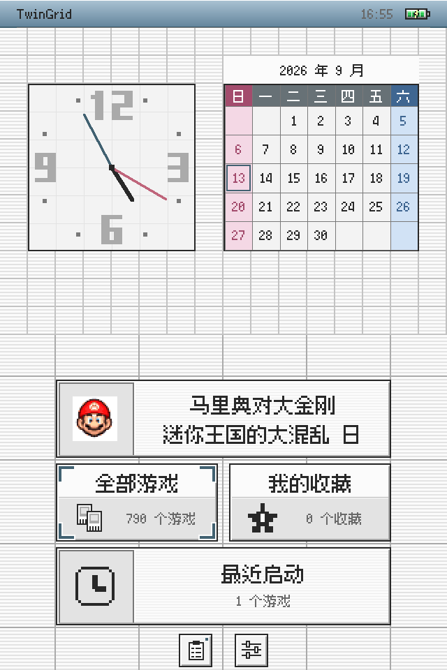
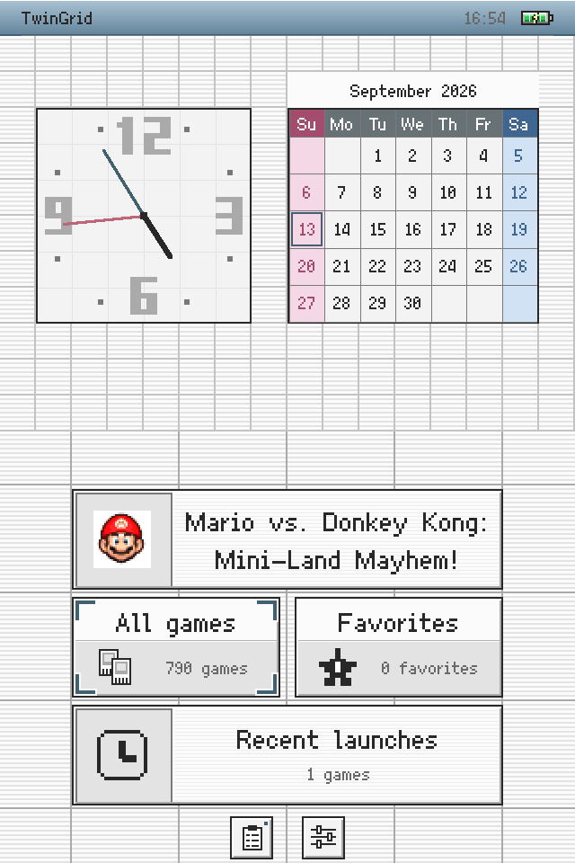
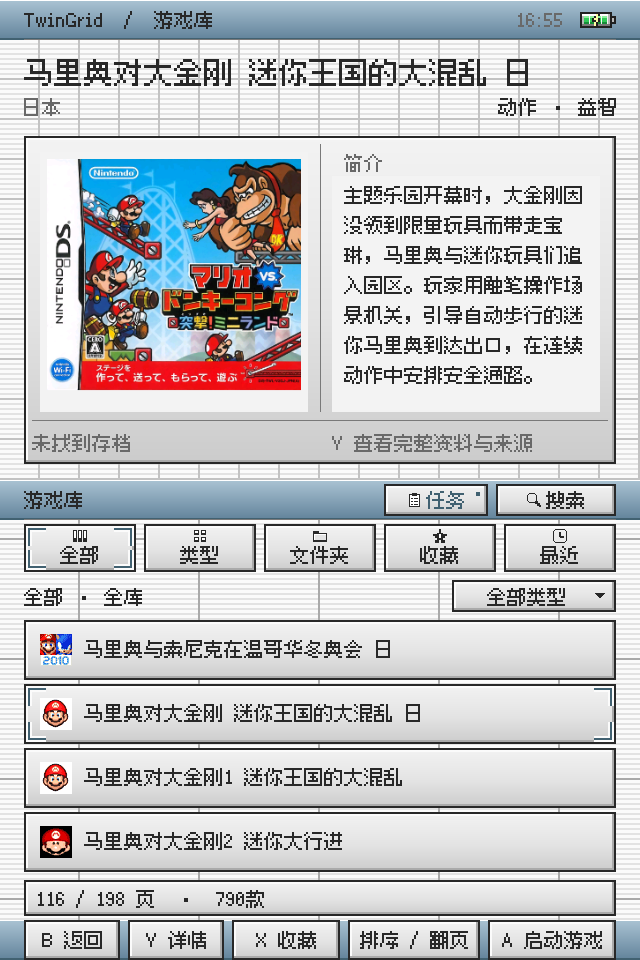
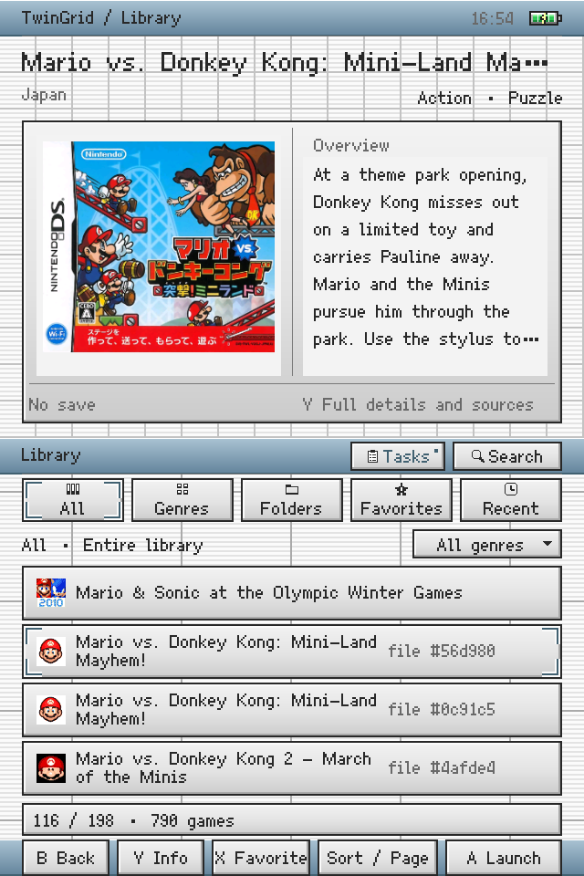
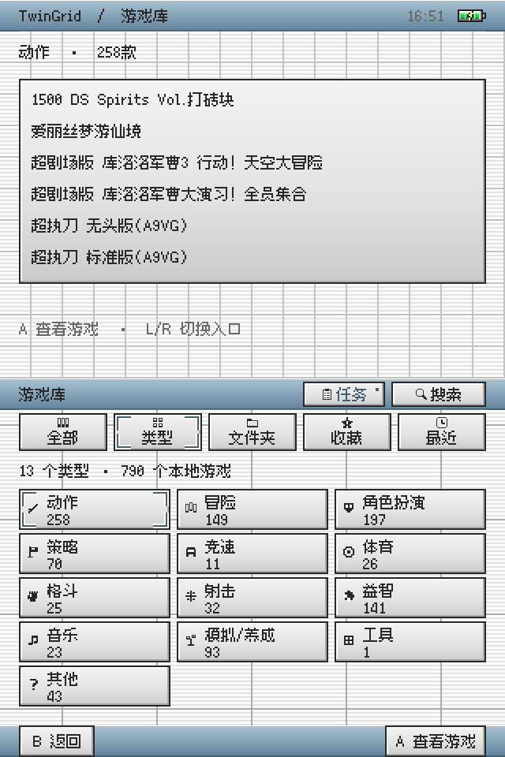
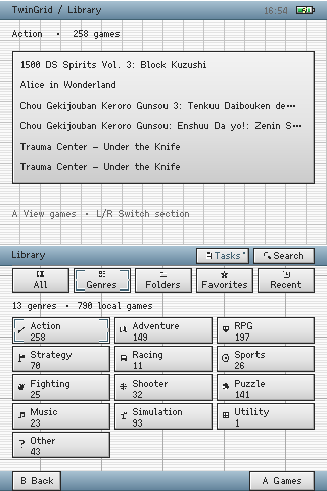

# TwinGrid

A Nintendo DS-focused dual-screen frontend for the Anbernic RG DS.

TwinGrid runs on the stock Android firmware and is designed to make
the RG DS feel more like a dedicated Nintendo DS handheld.

[简体中文](README.zh-CN.md) · [Downloads](https://github.com/Atomusk666/TwinGrid/releases) · [Report an issue](https://github.com/Atomusk666/TwinGrid/issues/new/choose)

**First public beta: 0.9.0, code135.** This is a pre-release, with the original
Android version and upgrade certificate preserved.

## Features

- No reflashing required.
- Dual-screen UI designed specifically for RG DS, with a DS / DS Lite-inspired pixel style.
- Folder, genre, search, favorites and recent library browsing.
- NDS banner icons read directly from your ROMs.
- Offline bilingual game metadata, with automatic genre and description matching.
- Online box-art matching and downloads, cached on the device.
- Direct DraStic launching where supported.
- Controller and touch navigation.
- Optional default-home selection through Android settings.
- Library organization leaves existing ROM and save files in place.

The catalog contains 7,701 release records and 3,417 works. Coverage varies:
1,360 works have edited bilingual text; 2,057 still lack that complete coverage.
Matching is an aid, and modified or translated ROMs may need manual correction.

## Screenshots

Actual **code135** captures from RG DS: Home, Library — All, and Library — Types,
in Chinese and English. Each image joins the complete upper screen above the
complete lower screen at native resolution (640 × 960), without cropping or retouching.

| Scene | 中文 | English |
| --- | --- | --- |
| Home / 首页 |  |  |
| Library — All / 游戏库 · 全部 |  |  |
| Library — Types / 游戏库 · 类型 |  |  |

[Screenshot provenance](assets/screenshots/README.md)

## Download and install

1. Download `TwinGrid-0.9.0-code135.apk` from [GitHub Releases](https://github.com/Atomusk666/TwinGrid/releases).
2. Install it on your RG DS.
3. Open TwinGrid.
4. Select your NDS ROM folder in the Android folder picker.
5. Optionally select your DraStic save folder.
6. Let TwinGrid scan and organize the library.
7. Configure DraStic if needed, and confirm it can manually open your game.

TwinGrid does not include ROMs, BIOS files or an emulator. No extra metadata
download is required for the bundled offline catalog.

The official APK keeps package `com.rgds.ultimate.shell` and the existing project
certificate. Earlier test builds signed with that certificate can be updated
in place. Do not uninstall to solve a signature mismatch: first check whether
you have an official compatible build. Uninstalling can remove app settings
and folder permissions. A developer build signed with a different key cannot
replace the official installation.

## Compatibility

### Tested

- **Anbernic RG DS**, stock firmware **1.18**, **Android 14 / API 34**.
- Stock Android DraStic package `com.dsemu.drastic`; compatibility is tied to
  the exact APK described in [Compatibility](docs/COMPATIBILITY.md).
- code135 has verified installation, data preservation and a targeted Chinese
  genre-page regression. Broad core and launch tests were performed on code134;
  they were not all repeated on code135. See [Validation](docs/VALIDATION.md).

Other devices and firmware versions have not been qualified.

### GammaOS

GammaOS compatibility has not been fully verified yet.

Since GammaOS is also Android, some functionality may work, but dual-screen
behavior, storage handling and DraStic integration may differ. Test reports
are welcome. The Gamma Nano native runner is not integrated.

### DraStic

**TwinGrid does not bundle DraStic.** Direct launching depends on its build and
the storage environment. An unknown version may launch correctly, need one-time
manual setup, open DraStic without loading the requested ROM, or be unsupported
by the current adapter. A compatible-looking Android receiver can be offered a
controlled trial; this does not mean it has been tested.

Selecting a game can replace the existing emulator task. Save in-game first:
unsaved progress is not automatically preserved. Returning to TwinGrid is not
proof that the emulator has closed or that a new ROM loaded successfully.

For a [compatibility report](https://github.com/Atomusk666/TwinGrid/issues/new?template=compatibility_report.yml),
include TwinGrid version, firmware, DraStic version and installation type,
SD/internal storage, whether the same ROM opens manually, and reproduction
steps. Review diagnostics before sharing; never attach ROMs or saves.

## How the library works

Use physical folders alongside virtual genre categories. Search finds catalog
names and aliases, with pinyin search support; favorites and recent entries
provide quick access. Automatic organization associates metadata and artwork
with library entries. It does not rename or move ROMs.

The optional save folder is used to match `.dsv` filenames and show existence,
size and modification time. TwinGrid does not edit save contents or convert
savestates. DraStic controls its own saves and may write them during play.

Box art is fetched on demand from a pinned libretro-thumbnails index using
JSDMirror, with jsDelivr fallback. Both routes share the same upstream library.
Availability depends on your network and those services. No downloaded game
covers are bundled as standalone assets in Git or the APK; the documentation
screenshots show artwork in the example library.

## Privacy and data

No TwinGrid account or project telemetry backend is required. Offline browsing
uses local data. Enabling artwork or online metadata requests contacts the
configured third-party services; they can see the IP address and requested
resource or query. Local diagnostics may include paths and game identifiers.
Exporting is explicit; review and redact before posting.

[FAQ](docs/FAQ.md) · [Public release audit](docs/PUBLIC_RELEASE_AUDIT.md) · [Security](SECURITY.md)

## Build and contribute

Source is in `app/src`, Android resources in `app/res`, pinned JARs in
`app/libs`, and the catalog registration in `catalog/`. This is a native
Java / Android View project with a PowerShell build, not a Gradle project.

Install PowerShell 7, JDK 17, Python 3 and Android SDK platform 34 with
build-tools 36.0.0. Set `JAVA_HOME` and `ANDROID_SDK_ROOT`, then run:

```powershell
pwsh scripts/build_v02.ps1 -VersionCode 135 -VersionName 0.9.0
```

This produces an **unsigned** developer APK without needing the release key.
See [Building](docs/BUILDING.md) for signing, checks and catalog details, and
[Contributing](CONTRIBUTING.md) for issue and pull-request guidance.

## License and background

TwinGrid's own source, original UI and documentation use the [MIT license](LICENSE).
Fonts, libraries and catalog data retain their separate licenses in
[Third-party notices](THIRD_PARTY_NOTICES.md). Game names and trademarks belong
to their respective owners. TwinGrid is not affiliated with Nintendo, Anbernic
or DraStic.

TwinGrid was previously developed under the working name RGDS Shell.
The Android package remains unchanged for upgrade compatibility.
